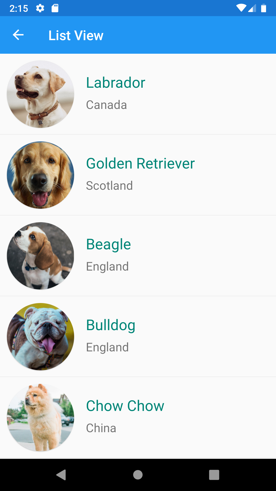

# TrichoForms

## Technologies and nuget packages used:
* [Xamarin.Forms](https://github.com/xamarin/Xamarin.Forms)
* [Acr.UserDialogs](https://github.com/aritchie/userdialogs)
* [CardsView](https://github.com/AndreiMisiukevich/CardView)
* [MvvmCross and MvvmCross Forms](https://www.mvvmcross.com/)
* Newtonsoft.Json
* [Xamarin.Essentials](https://github.com/xamarin/Essentials)
* Xamarin.Forms.Visual.Material

